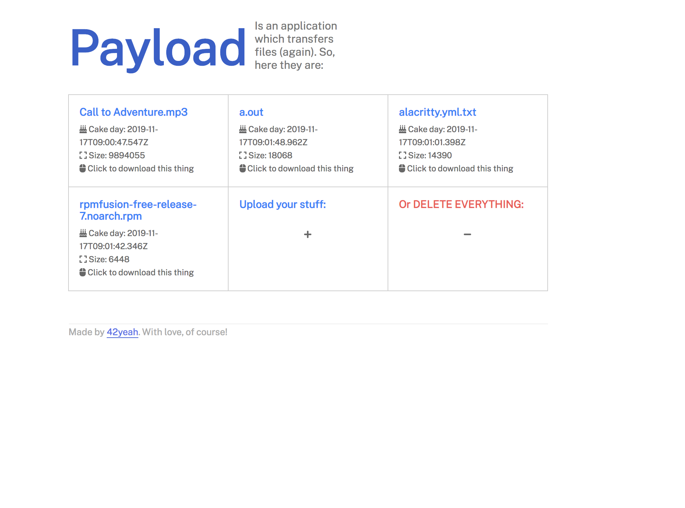

## Payload 




Payload is yet another file transfer application. (Yeah yeah, it's boring-ass, right?)

However, it offers a clean & slick interface (and a very messy code base)! Also a easily-pressable red button to delete all your stuffs at once! What's even better, it is WTFPL licensed! I mean how cool is that?!! 

You can serve the web file and the server separately, as API and static files are completely separated. So yeah, it is out there, I might not update it again, & do whatever you want! Thank you!

## License

```
        DO WHAT THE FUCK YOU WANT TO PUBLIC LICENSE 
                    Version 2, December 2004 

 Copyright (C) 2004 Sam Hocevar <sam@hocevar.net> 

 Everyone is permitted to copy and distribute verbatim or modified 
 copies of this license document, and changing it is allowed as long 
 as the name is changed. 

            DO WHAT THE FUCK YOU WANT TO PUBLIC LICENSE 
   TERMS AND CONDITIONS FOR COPYING, DISTRIBUTION AND MODIFICATION 

  0. You just DO WHAT THE FUCK YOU WANT TO.
```
